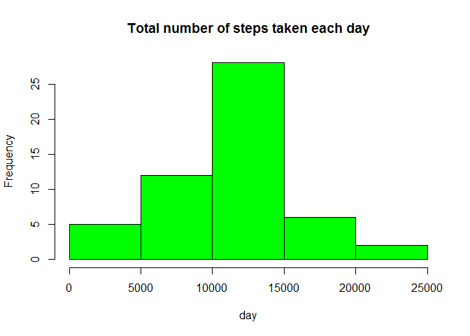
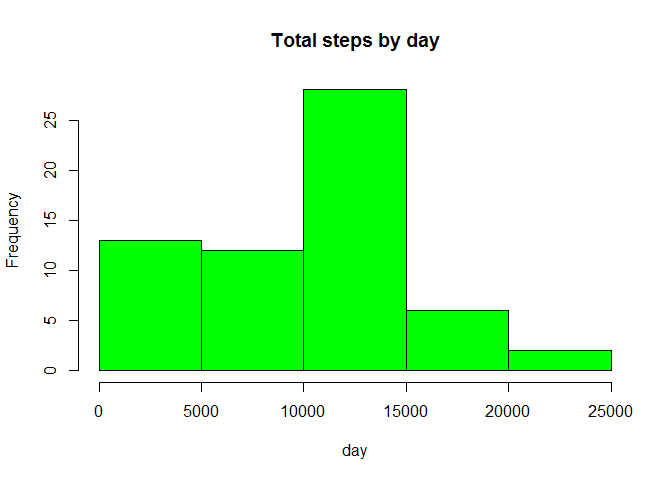
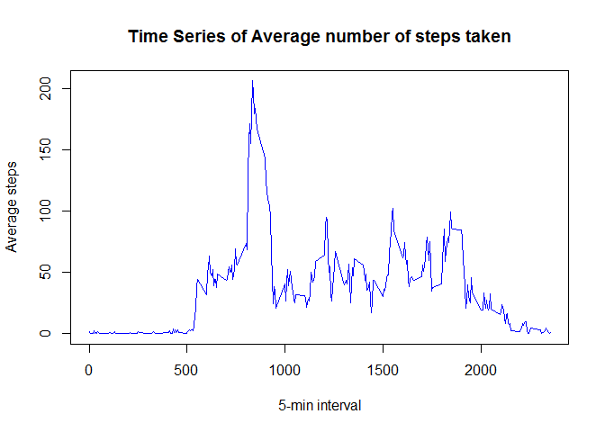
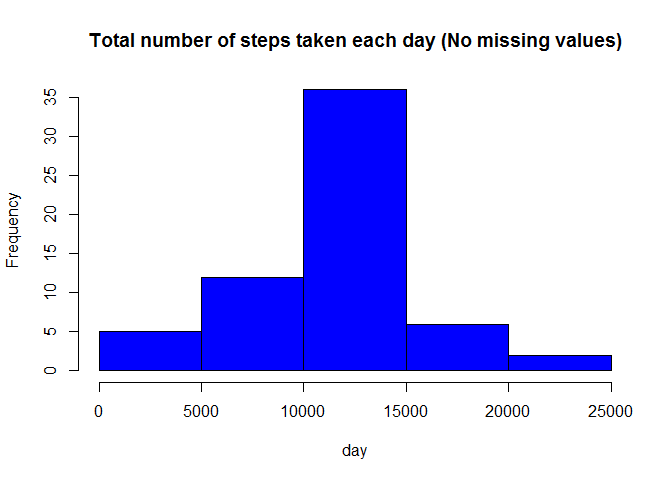
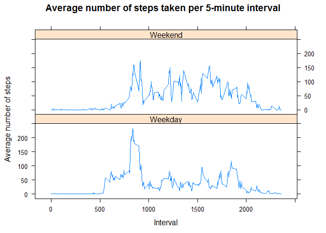

#Reproducible Research: Peer assessment 1

##Introduction

This assignment makes use of data from a personal activity monitoring device. This device collects data at 5 minute intervals through out the day. The data consists of two months of data from an anonymous individual collected during the months of October and November, 2012 and include the number of steps taken in 5 minute intervals each day.

The data for this assignment can be downloaded from the course web site:

Dataset: Activity monitoring data [52K]
https://d396qusza40orc.cloudfront.net/repdata%2Fdata%2Factivity.zip

The variables included in this dataset are:

steps: Number of steps taking in a 5-minute interval (missing values are coded as NA)
date: The date on which the measurement was taken in YYYY-MM-DD format
interval: Identifier for the 5-minute interval in which measurement was taken
The dataset is stored in a comma-separated-value (CSV) file and there are a total of 17,568 observations in this dataset.


### Set the Global options
Throughout this report when writing code chunks in the R markdown document, always use echo = TRUE so that someone else will be able to read the code.

```r
knitr::opts_chunk$set(echo = TRUE)
```

###Load required libraries

```r
	library(lattice)
	library(knitr)
```

###1. Code for reading in the dataset and/or processing the data

```r
setwd("C:/Data Science/05. Reproducible Research")
```
		
a. set the filename

		
b. Make sure data folder exists. Else create the folder named "Data"

```r
	if(!file.exists("Data")) { 
	dir.create("Data")
	}

	setwd("C:/Data Science/05. Reproducible Research/Data")
```

c. Download the dataset:

```r
	if (!file.exists(Zip_file)){
	fileURL <- "https://d396qusza40orc.cloudfront.net/repdata%2Fdata%2Factivity.zip"
	download.file(fileURL, Zip_file, mode="wb")
	} 
```

d. unzip the dataset:

```r
	if (!file.exists(filename)) {
	unzip(Zip_file) 
	}
```

e. reading in the dataset

```r
	activity <- read.csv("activity.csv", colClasses = c("numeric", "character", "numeric"))

	head(activity)			  
```

```
##   steps       date interval
## 1    NA 2012-10-01        0
## 2    NA 2012-10-01        5
## 3    NA 2012-10-01       10
## 4    NA 2012-10-01       15
## 5    NA 2012-10-01       20
## 6    NA 2012-10-01       25
```

```r
	str(activity)
```

```
## 'data.frame':	17568 obs. of  3 variables:
##  $ steps   : num  NA NA NA NA NA NA NA NA NA NA ...
##  $ date    : chr  "2012-10-01" "2012-10-01" "2012-10-01" "2012-10-01" ...
##  $ interval: num  0 5 10 15 20 25 30 35 40 45 ...
```

f. format the date	

```r
	activity$date <- as.Date(activity$date, "%Y-%m-%d")

	str(activity)
```

```
## 'data.frame':	17568 obs. of  3 variables:
##  $ steps   : num  NA NA NA NA NA NA NA NA NA NA ...
##  $ date    : Date, format: "2012-10-01" "2012-10-01" ...
##  $ interval: num  0 5 10 15 20 25 30 35 40 45 ...
```
	
###2. Histogram of the total number of steps taken each day
 a. Calculate the total number of steps taken each day

```r
 	tot_steps <- aggregate(steps ~ date, data = activity, sum, na.rm = TRUE)
 	
 	str(tot_steps)
```

```
## 'data.frame':	53 obs. of  2 variables:
##  $ date : Date, format: "2012-10-02" "2012-10-03" ...
##  $ steps: num  126 11352 12116 13294 15420 ...
```

```r
 	summary(tot_steps)
```

```
##       date                steps      
##  Min.   :2012-10-02   Min.   :   41  
##  1st Qu.:2012-10-16   1st Qu.: 8841  
##  Median :2012-10-29   Median :10765  
##  Mean   :2012-10-30   Mean   :10766  
##  3rd Qu.:2012-11-16   3rd Qu.:13294  
##  Max.   :2012-11-29   Max.   :21194
```
 	
 b. Make a histogram of the total number of steps taken each day

```r
 	hist(tot_steps$steps, main = "Total number of steps taken each day", xlab = "day",ylab = "Frequency", col = "green")
```

<!-- -->

###3. Mean and median number of steps taken each day

```r
		mean(tot_steps$steps)
```

```
## [1] 10766.19
```

```r
		median(tot_steps$steps)
```

```
## [1] 10765
```
		
###4. Time series plot of the average number of steps taken
a. Calculate Time series plot of the average number of steps taken

```r
	steps <- rep(NA, 61)
	day <- rep("NA", 61)
	sum_steps <- tapply(activity$steps, activity$date, sum, na.rm = TRUE)
	length(sum_steps)
```

```
## [1] 61
```

```r
	for (i in 1:length(sum_steps)) {
			steps[i] <- sum_steps[[i]]
			day[i] <- names(sum_steps)[i]
	}
	
	activity_df <- data.frame(day, steps)
	head(activity_df)
```

```
##          day steps
## 1 2012-10-01     0
## 2 2012-10-02   126
## 3 2012-10-03 11352
## 4 2012-10-04 12116
## 5 2012-10-05 13294
## 6 2012-10-06 15420
```

```r
	hist(activity_df$steps, main = "Total steps by day", xlab = "day", col = "green")
```

<!-- -->

```r
	time_series <- tapply(activity$steps, activity$interval, mean, na.rm = TRUE)
```
	
b. Plot Time series plot of the average number of steps taken

```r
	plot(row.names(time_series), time_series, type = "l", xlab = "5-min interval", ylab = "Average steps", main = "Time Series of Average number of steps taken", col = "blue")
```

<!-- -->
			
###5. The 5-minute interval that, on average, contains the maximum number of steps

```r
	average_steps <- aggregate(steps ~ interval, data = activity, FUN = mean)
	max_interval <- average_steps[which.max(average_steps$steps),]
	max_interval 
```

```
##     interval    steps
## 104      835 206.1698
```
		
###6. Code to describe and show a strategy for imputing missing data
	a. Total number of missing values:

```r
	missing_activity <- sum(is.na(activity))
	missing_activity
```

```
## [1] 2304
```
		
	b. Devise a strategy for filling in all of the missing values in the dataset

```r
	fillNA <- numeric()
	for (i in 1:nrow(activity)) {
		obs <- activity[i, ]
		if (is.na(obs$steps)) {
			steps <- subset(average_steps, interval == obs$interval)$steps
		} else {
			steps <- obs$steps
		}
		fillNA <- c(fillNA, steps)
	}
```
		
	c. Make sure there is no more missing values	
		*sum(is.na(No_missing_activity$steps <- fillNA)) = 0*

```r
	No_missing_activity <- activity
	No_missing_activity$steps <- fillNA
	sum(is.na(No_missing_activity$steps))
```

```
## [1] 0
```
		
###7. Histogram of the total number of steps taken each day after missing values are imputed
	a. Calculate total number of steps taken each day after missing values are imputed

```r
		tot_steps2 <- aggregate(steps ~ date, data = No_missing_activity, sum, na.rm = TRUE)
		str(tot_steps2)
```

```
## 'data.frame':	61 obs. of  2 variables:
##  $ date : Date, format: "2012-10-01" "2012-10-02" ...
##  $ steps: num  10766 126 11352 12116 13294 ...
```

```r
		summary(tot_steps2)
```

```
##       date                steps      
##  Min.   :2012-10-01   Min.   :   41  
##  1st Qu.:2012-10-16   1st Qu.: 9819  
##  Median :2012-10-31   Median :10766  
##  Mean   :2012-10-31   Mean   :10766  
##  3rd Qu.:2012-11-15   3rd Qu.:12811  
##  Max.   :2012-11-30   Max.   :21194
```
	b. plotting the histogram

```r
		hist(tot_steps2$steps, main = "Total number of steps taken each day (No missing values)", xlab = "day",ylab = "Frequency", col = "blue")
```

<!-- -->
		
	c. Calculate and report the mean and median total number of steps taken per day.

```r
		mean(tot_steps2$steps)
```

```
## [1] 10766.19
```

```r
		median(tot_steps2$steps)
```

```
## [1] 10766.19
```
			
###8. Panel plot comparing the average number of steps taken per 5-minute interval across weekdays and weekends
 a. Subset the day into two levels - weekends (Saturday and Sunday) and weekdays (Monday through Friday).

```r
 	day <- weekdays(activity$date)
 	daylevel <- vector()
 	for (i in 1:nrow(activity)) {
 		if (day[i] == "Saturday") {
 			daylevel[i] <- "Weekend"
 		} else if (day[i] == "Sunday") {
 			daylevel[i] <- "Weekend"
 		} else {
 			daylevel[i] <- "Weekday"
 		}
 	}
```
 b. create a new column.	

```r
 	str(activity)
```

```
## 'data.frame':	17568 obs. of  3 variables:
##  $ steps   : num  NA NA NA NA NA NA NA NA NA NA ...
##  $ date    : Date, format: "2012-10-01" "2012-10-01" ...
##  $ interval: num  0 5 10 15 20 25 30 35 40 45 ...
```

```r
 	activity$daylevel <- daylevel
 	str(activity)
```

```
## 'data.frame':	17568 obs. of  4 variables:
##  $ steps   : num  NA NA NA NA NA NA NA NA NA NA ...
##  $ date    : Date, format: "2012-10-01" "2012-10-01" ...
##  $ interval: num  0 5 10 15 20 25 30 35 40 45 ...
##  $ daylevel: chr  "Weekday" "Weekday" "Weekday" "Weekday" ...
```

```r
 	activity$daylevel <- factor(activity$daylevel)
 	str(activity)
```

```
## 'data.frame':	17568 obs. of  4 variables:
##  $ steps   : num  NA NA NA NA NA NA NA NA NA NA ...
##  $ date    : Date, format: "2012-10-01" "2012-10-01" ...
##  $ interval: num  0 5 10 15 20 25 30 35 40 45 ...
##  $ daylevel: Factor w/ 2 levels "Weekday","Weekend": 1 1 1 1 1 1 1 1 1 1 ...
```
 	
 c. Tabulate the average steps per interval for each data set.	

```r
        avg_steps_interval <- aggregate(steps ~ interval + daylevel, data = activity, mean)
 	str(avg_steps_interval)
```

```
## 'data.frame':	576 obs. of  3 variables:
##  $ interval: num  0 5 10 15 20 25 30 35 40 45 ...
##  $ daylevel: Factor w/ 2 levels "Weekday","Weekend": 1 1 1 1 1 1 1 1 1 1 ...
##  $ steps   : num  2.333 0.462 0.179 0.205 0.103 ...
```

```r
 	names(avg_steps_interval) <- c("interval", "daylevel", "steps")
```
 	
 d. Plot the two data sets side by side for comparison.

```r
 	xyplot(steps ~ interval | daylevel, avg_steps_interval, type = "l", layout = c(1, 2), main = "Average number of steps taken per 5-minute interval", xlab = "Interval", ylab = "Average number of steps")
```

<!-- -->
